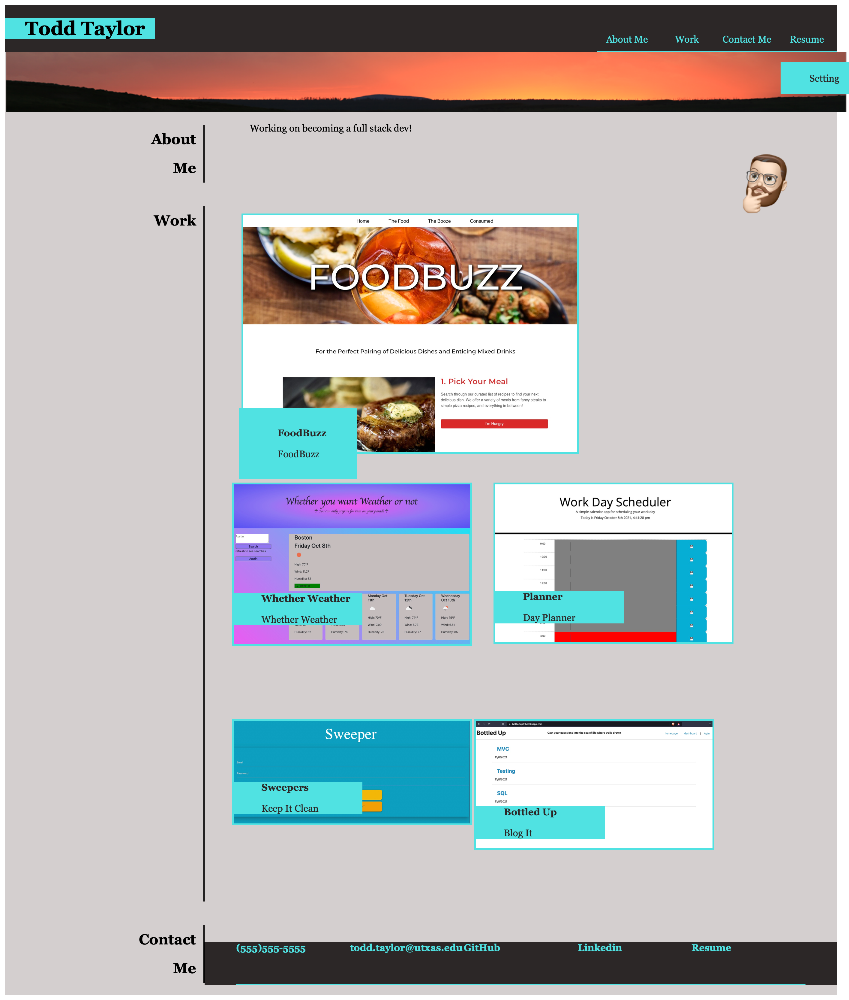

# Homework-02-Portfolio-TT
## Portfolio
Todd Taylor
9-20 (Unification Day)...
Now we fade to a cool November day

  # Updated Portfolio

  ## Table of Contents
  * [Description](#descrip)
  * [Installation](#install)
  * [Usage](#usage)
  * [Contributions](#contri)
  * [Tests](#tests)
  * [Contact & Qustions](#contact)
  * [License](#license)
  * [Powered By](#powered-by)
  
  ### Description:
      Update the portfolio to include 3 works that you have completed from class of in projects.  Github with 3 pinned items. 
### Workflow
We were tasked with creating a website to showcase the projects that we will create in this course.  
Since we have no real projects, I populated stuff with my wonderful animal and location photos.  The links will take you to nice websites that will make you want to break your chains of quiet solitude grading endless projects. Consider this fair warning to not look any further.  

We were instructed to follow our guide Virgil through this process and make a website using Flexboxes.  Once this project was completed, we were laughed at and someone said, "bootstrap."  I think this might be a program, but couldn't make out the correct name due to distorted words coming through the gasps for air. 

The About me is very original and I think it will probably bring a nostagic tear to any prospective employer's eye.  Some say that I have a true talent for prose, but I find my style relatively generic. 

I think there are roughly 5002 divs and display: flex in the index.html.  I had heard the horror stories that these boxes can call, so I choose to use them to create the title bar, the banner, and the three lower sections.  The sections have a reseved width for the left column.  The column could be thinner, but I feared the lack of support would cause the structure to collapse.  No structual engineering background, so I had to just use my eye to judge it.  

We were also instructed to place an image of ourselves on the page.  One of these things represents me.  I'd like to think it was the moose.  It is just a shame that he dropped his antlers before I got his picture... or is it my portrait....

The links at the page are active and move to the appropriate linked id down the page.  

  
  ### Installation:
      https://github.com/DerTodd/Homework-02-Portfolio-TT

  
  ### Usage: 
      Show your work

  
  ### Contributions:
      N/A

  
  ### Tests
      N/A

  
  ### Contact & Qustions
  If you have any questions, suggestions or concerns, please contact me at:  
  GitHub  
  https://github.com/DerTodd  
  https://github.com/DerTodd/Homework-02-Portfolio-TT
  https://dertodd.github.io/Homework-02-Portfolio-TT/

  email  
      todd.taylor@utexas.edu  

  
  ### License:
  [MIT](https://opensource.org/licenses/MIT)

  
  #### Powered By
    
    
   

### Website

#### Links
My favorite [Portfolio](https://dertodd.github.io/Homework-02-Portfolio-TT/)

My favorite [GitHub](https://github.com/DerTodd/Homework-02-Portfolio-TT)